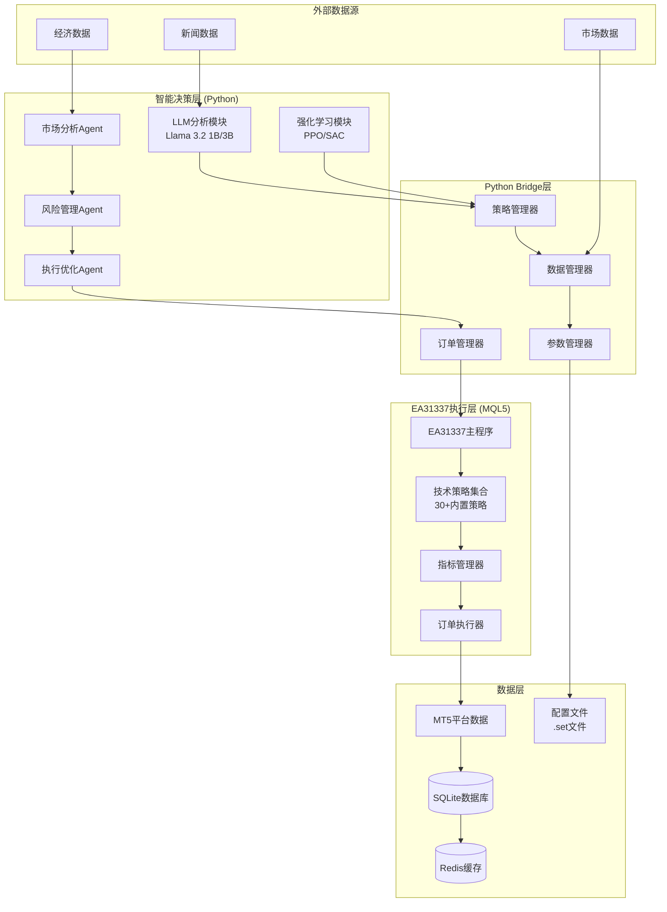

# Design Document

## Overview

本设计文档描述了一个基于EA31337框架的智能MT5交易系统，该系统集成了大语言模型(LLM)和强化学习(RL)技术。系统采用三层混合架构：EA31337执行层、Python Bridge中间层和智能决策层，实现了从基础交易执行到高级智能分析的完整交易解决方案。

### 核心设计原则

1. **分层解耦**: 各层职责明确，便于维护和扩展
2. **渐进式风险管理**: 从保守到激进的资金管理策略
3. **本地化优先**: 优先使用本地模型，保护数据隐私
4. **品种适应性**: 针对不同交易品种的专门优化
5. **实时响应**: 毫秒级的交易决策和执行能力

## Architecture

### 系统整体架构



### 技术栈选择

#### 核心框架层
- **MT5平台**: MetaTrader 5作为交易执行平台
- **EA31337**: 成熟的MQL5交易框架，提供30+内置策略
- **Python 3.9+**: 主控制语言，负责智能决策

#### 数据处理层
- **MetaTrader5 Python库**: 官方MT5 Python API
- **pandas + numpy**: 时序数据处理和数值计算
- **ta-lib**: 技术指标计算库
- **asyncio**: 异步处理订单和数据流

#### 机器学习层
- **stable-baselines3**: 强化学习算法实现(PPO/SAC)
- **gymnasium**: RL环境框架
- **scikit-learn**: 传统机器学习模型
- **optuna**: 超参数优化

#### LLM集成层
- **transformers**: Hugging Face模型库
- **llama-cpp-python**: 本地Llama模型推理
- **langchain**: LLM应用开发框架

#### 数据存储层
- **SQLite**: 轻量级关系数据库
- **Redis**: 内存缓存和消息队列
- **CSV**: 数据备份格式

## Components and Interfaces

### 1. EA31337集成组件

#### EA31337Bridge类
```python
class EA31337Bridge:
    """EA31337框架集成桥接器"""
    
    def __init__(self, config_path: str):
        self.config_path = config_path
        self.signal_file = "signals.json"
        self.status_file = "status.json"
    
    def update_parameters(self, strategy: str, params: dict) -> bool:
        """动态更新EA策略参数"""
        
    def get_signals(self) -> List[Signal]:
        """获取EA生成的交易信号"""
        
    def get_status(self) -> dict:
        """获取EA运行状态"""
        
    def send_command(self, command: str, params: dict) -> bool:
        """向EA发送控制命令"""
```

#### 策略配置管理
```python
class StrategyConfigManager:
    """管理.set配置文件"""
    
    def load_config(self, strategy_name: str) -> dict:
        """加载策略配置"""
        
    def save_config(self, strategy_name: str, config: dict) -> bool:
        """保存策略配置"""
        
    def optimize_parameters(self, strategy_name: str, symbol: str) -> dict:
        """优化策略参数"""
```

### 2. 数据管理组件

#### 数据管道设计
```python
class DataPipeline:
    """统一数据获取和处理管道"""
    
    def __init__(self):
        self.mt5_connection = MT5Connection()
        self.db_manager = DatabaseManager()
        self.redis_cache = RedisCache()
        self.data_validator = DataValidator()
    
    def get_realtime_data(self, symbol: str, timeframe: str) -> MarketData:
        """获取实时市场数据"""
        
    def get_historical_data(self, symbol: str, start: datetime, end: datetime) -> DataFrame:
        """获取历史数据"""
        
    def cache_data(self, key: str, data: any, ttl: int = 300) -> bool:
        """缓存数据到Redis"""
```

#### 数据结构定义
```python
@dataclass
class MarketData:
    symbol: str
    timeframe: str
    timestamp: datetime
    ohlcv: DataFrame
    indicators: Dict[str, float]
    spread: float
    liquidity: float
    volume_profile: Dict[str, float]

@dataclass
class Signal:
    strategy_id: str
    symbol: str
    direction: int  # 1=买入, -1=卖出, 0=平仓
    strength: float  # 信号强度 0-1
    entry_price: float
    sl: float
    tp: float
    size: float
    confidence: float
    timestamp: datetime
    metadata: Dict[str, any]
```

### 3. 智能Agent系统

#### 市场分析Agent
```python
class MarketAnalystAgent:
    """市场分析智能体"""
    
    def __init__(self):
        self.technical_analyzer = TechnicalAnalyzer()
        self.regime_detector = MarketRegimeDetector()
        self.correlation_analyzer = CorrelationAnalyzer()
    
    def analyze_market_state(self, symbol: str) -> MarketState:
        """分析市场状态"""
        return MarketState(
            trend=self.detect_trend(symbol),
            volatility=self.calculate_volatility(symbol),
            regime=self.regime_detector.detect(symbol),
            support_resistance=self.find_sr_levels(symbol),
            correlation_matrix=self.correlation_analyzer.analyze()
        )
    
    def generate_market_outlook(self, symbols: List[str]) -> MarketOutlook:
        """生成市场展望"""
```

#### 风险管理Agent
```python
class RiskManagerAgent:
    """风险管理智能体"""
    
    def __init__(self, config: RiskConfig):
        self.max_risk_per_trade = config.max_risk_per_trade
        self.max_daily_drawdown = config.max_daily_drawdown
        self.correlation_threshold = config.correlation_threshold
        self.var_calculator = VaRCalculator()
    
    def validate_trade(self, signal: Signal, portfolio: Portfolio) -> ValidationResult:
        """验证交易信号"""
        
    def calculate_position_size(self, signal: Signal, account: Account) -> float:
        """计算仓位大小"""
        
    def monitor_portfolio_risk(self, portfolio: Portfolio) -> RiskMetrics:
        """监控组合风险"""
        
    def trigger_risk_controls(self, portfolio: Portfolio) -> List[RiskAction]:
        """触发风险控制措施"""
```

#### LLM分析Agent
```python
class LLMAnalystAgent:
    """LLM分析智能体"""
    
    def __init__(self, model_path: str):
        self.model = LlamaModel(model_path)
        self.news_scraper = NewsScraper()
        self.sentiment_analyzer = SentimentAnalyzer()
    
    def analyze_news_sentiment(self, symbol: str) -> SentimentAnalysis:
        """分析新闻情绪"""
        
    def generate_market_commentary(self, market_data: MarketData) -> str:
        """生成市场评论"""
        
    def analyze_economic_events(self, events: List[EconomicEvent]) -> EventImpact:
        """分析经济事件影响"""
```

### 4. 强化学习组件

#### RL交易环境
```python
class TradingEnvironment(gymnasium.Env):
    """强化学习交易环境"""
    
    def __init__(self, symbol: str, data_provider: DataProvider):
        self.symbol = symbol
        self.data_provider = data_provider
        
        # 状态空间：价格、指标、持仓、市场状态等
        self.observation_space = spaces.Box(
            low=-np.inf, high=np.inf, shape=(100,), dtype=np.float32
        )
        
        # 动作空间：买入、卖出、持有、调整仓位
        self.action_space = spaces.Discrete(5)
    
    def step(self, action: int) -> Tuple[np.ndarray, float, bool, dict]:
        """执行动作并返回新状态"""
        
    def calculate_reward(self, action: int, prev_value: float, current_value: float) -> float:
        """计算奖励函数"""
        # 考虑收益、风险调整、交易成本
        return_reward = (current_value - prev_value) / prev_value
        risk_penalty = self.calculate_risk_penalty()
        cost_penalty = self.calculate_transaction_cost(action)
        
        return return_reward - risk_penalty - cost_penalty
```

#### RL训练器
```python
class RLTrainer:
    """强化学习训练器"""
    
    def __init__(self, env: TradingEnvironment):
        self.env = env
        self.model = PPO("MlpPolicy", env, verbose=1)
        self.callback_manager = CallbackManager()
    
    def train(self, total_timesteps: int) -> None:
        """训练RL模型"""
        
    def evaluate(self, n_episodes: int = 100) -> Dict[str, float]:
        """评估模型性能"""
        
    def save_model(self, path: str) -> None:
        """保存训练好的模型"""
```

### 5. 策略管理系统

#### 多策略管理器
```python
class StrategyManager:
    """多策略管理器"""
    
    def __init__(self):
        self.strategies = {
            # EA31337策略
            'ea31337_trend': EA31337Strategy('trend.set'),
            'ea31337_scalp': EA31337Strategy('scalp.set'),
            'ea31337_breakout': EA31337Strategy('breakout.set'),
            
            # Python原生策略
            'ml_pattern': MLPatternStrategy(),
            'mean_reversion': MeanReversionStrategy(),
            'momentum': MomentumStrategy(),
            
            # LLM增强策略
            'llm_news': LLMNewsStrategy(),
            'llm_sentiment': LLMSentimentStrategy(),
        }
        
        self.weights = {}
        self.performance_tracker = PerformanceTracker()
        self.rl_optimizer = RLOptimizer()
    
    def generate_signals(self, market_data: MarketData) -> List[Signal]:
        """生成综合交易信号"""
        
    def update_strategy_weights(self, performance_data: Dict[str, float]) -> None:
        """更新策略权重"""
        
    def select_active_strategies(self, market_state: MarketState) -> List[str]:
        """根据市场状态选择活跃策略"""
```

## Data Models

### 核心数据模型

#### 账户模型
```python
class Account:
    account_id: str
    balance: float
    equity: float
    margin: float
    free_margin: float
    margin_level: float
    currency: str
    leverage: int
    
    def get_risk_metrics(self) -> RiskMetrics:
        """获取账户风险指标"""
        
    def can_open_position(self, size: float, symbol: str) -> bool:
        """检查是否可以开仓"""
```

#### 持仓模型
```python
class Position:
    position_id: str
    symbol: str
    type: PositionType  # LONG/SHORT
    volume: float
    open_price: float
    current_price: float
    sl: float
    tp: float
    profit: float
    swap: float
    commission: float
    open_time: datetime
    
    def update_trailing_stop(self, new_sl: float) -> bool:
        """更新追踪止损"""
        
    def calculate_unrealized_pnl(self) -> float:
        """计算未实现盈亏"""
```

#### 交易记录模型
```python
class Trade:
    trade_id: str
    symbol: str
    type: TradeType
    volume: float
    open_price: float
    close_price: float
    sl: float
    tp: float
    profit: float
    commission: float
    swap: float
    open_time: datetime
    close_time: datetime
    strategy_id: str
    
    def calculate_metrics(self) -> TradeMetrics:
        """计算交易指标"""
```

### 配置数据模型

#### 品种配置
```python
class SymbolConfig:
    symbol: str
    spread_limit: float
    min_lot: float
    max_lot: float
    strategies: List[str]
    timeframes: List[str]
    risk_multiplier: float
    trading_hours: Dict[str, str]
    optimize_params: Dict[str, Tuple[float, float, float]]
    
    def is_trading_time(self, current_time: datetime) -> bool:
        """检查是否在交易时间内"""
        
    def get_optimized_params(self, strategy: str) -> Dict[str, float]:
        """获取优化后的参数"""
```

## Error Handling

### 异常处理策略

#### 连接异常处理
```python
class ConnectionManager:
    """连接管理器"""
    
    def __init__(self, max_retries: int = 3):
        self.max_retries = max_retries
        self.retry_delay = 5  # 秒
    
    def ensure_connection(self) -> bool:
        """确保MT5连接正常"""
        for attempt in range(self.max_retries):
            if self.test_connection():
                return True
            time.sleep(self.retry_delay)
        
        raise ConnectionError("无法连接到MT5平台")
    
    def handle_connection_loss(self) -> None:
        """处理连接丢失"""
        logger.error("MT5连接丢失，尝试重连...")
        self.reconnect()
```

#### 交易异常处理
```python
class TradeErrorHandler:
    """交易错误处理器"""
    
    def handle_order_error(self, error_code: int, signal: Signal) -> OrderResult:
        """处理订单错误"""
        error_actions = {
            10004: self.handle_no_money,      # 资金不足
            10006: self.handle_invalid_request, # 无效请求
            10013: self.handle_invalid_volume,  # 无效手数
            10015: self.handle_invalid_price,   # 无效价格
            10016: self.handle_invalid_stops,   # 无效止损止盈
        }
        
        if error_code in error_actions:
            return error_actions[error_code](signal)
        else:
            return self.handle_unknown_error(error_code, signal)
```

#### 数据异常处理
```python
class DataValidator:
    """数据验证器"""
    
    def validate_market_data(self, data: MarketData) -> ValidationResult:
        """验证市场数据完整性"""
        checks = [
            self.check_data_completeness(data),
            self.check_data_consistency(data),
            self.check_data_freshness(data),
            self.check_spread_validity(data),
        ]
        
        return ValidationResult(
            is_valid=all(checks),
            errors=[check.error for check in checks if not check.is_valid]
        )
```

## Testing Strategy

### 测试框架设计

#### 单元测试
```python
class TestStrategyManager(unittest.TestCase):
    """策略管理器单元测试"""
    
    def setUp(self):
        self.strategy_manager = StrategyManager()
        self.mock_data = self.create_mock_market_data()
    
    def test_signal_generation(self):
        """测试信号生成"""
        signals = self.strategy_manager.generate_signals(self.mock_data)
        self.assertIsInstance(signals, list)
        self.assertTrue(len(signals) > 0)
    
    def test_strategy_weight_update(self):
        """测试策略权重更新"""
        performance = {'strategy1': 0.15, 'strategy2': -0.05}
        self.strategy_manager.update_strategy_weights(performance)
        # 验证权重更新逻辑
```

#### 集成测试
```python
class TestSystemIntegration(unittest.TestCase):
    """系统集成测试"""
    
    def test_ea31337_integration(self):
        """测试EA31337集成"""
        bridge = EA31337Bridge("test_config/")
        signals = bridge.get_signals()
        self.assertIsInstance(signals, list)
    
    def test_llm_integration(self):
        """测试LLM集成"""
        llm_agent = LLMAnalystAgent("models/llama-3.2-1b")
        sentiment = llm_agent.analyze_news_sentiment("EURUSD")
        self.assertIsInstance(sentiment, SentimentAnalysis)
```

#### 回测测试
```python
class BacktestFramework:
    """回测测试框架"""
    
    def __init__(self):
        self.data_loader = HistoricalDataLoader()
        self.performance_analyzer = PerformanceAnalyzer()
    
    def run_strategy_backtest(self, strategy: Strategy, symbol: str, 
                            start_date: str, end_date: str) -> BacktestResult:
        """运行策略回测"""
        
    def run_monte_carlo_simulation(self, strategy: Strategy, 
                                 n_simulations: int = 1000) -> MonteCarloResult:
        """运行蒙特卡洛模拟"""
```

### 性能测试

#### 延迟测试
```python
class LatencyTester:
    """延迟测试器"""
    
    def test_signal_generation_latency(self) -> float:
        """测试信号生成延迟"""
        
    def test_order_execution_latency(self) -> float:
        """测试订单执行延迟"""
        
    def test_data_processing_latency(self) -> float:
        """测试数据处理延迟"""
```

#### 压力测试
```python
class StressTester:
    """压力测试器"""
    
    def test_high_frequency_signals(self, signals_per_second: int) -> TestResult:
        """测试高频信号处理能力"""
        
    def test_memory_usage(self, duration_hours: int) -> MemoryUsageReport:
        """测试内存使用情况"""
        
    def test_concurrent_strategies(self, n_strategies: int) -> ConcurrencyTestResult:
        """测试并发策略处理"""
```

这个设计文档提供了完整的系统架构、组件设计、数据模型、错误处理和测试策略。系统采用分层架构，确保了各组件的解耦和可维护性，同时集成了现代AI技术来增强交易决策能力。